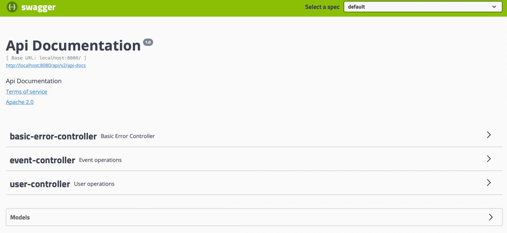

# МТС

Project Afisha, backend part

_Galimzhanov Daniyar_ 


## Api documentation

You can access api documentation after running project

<http://localhost:8080/api/swagger-ui.html#/>

<http://ec2-3-17-146-147.us-east-2.compute.amazonaws.com:8080/api/swagger-ui.html#/>



It is implemented with swagger

## Run spring application

```
cd src/main/docker

docker-compose up
```

## Rebuild image

After changes, it is required to rebuild image

```
./mvnw clean package -DskipTests

cp target/afisha_api-0.0.1-SNAPSHOT.jar src/main/docker

docker rmi docker-afisha-api:latest

docker-compose up
```